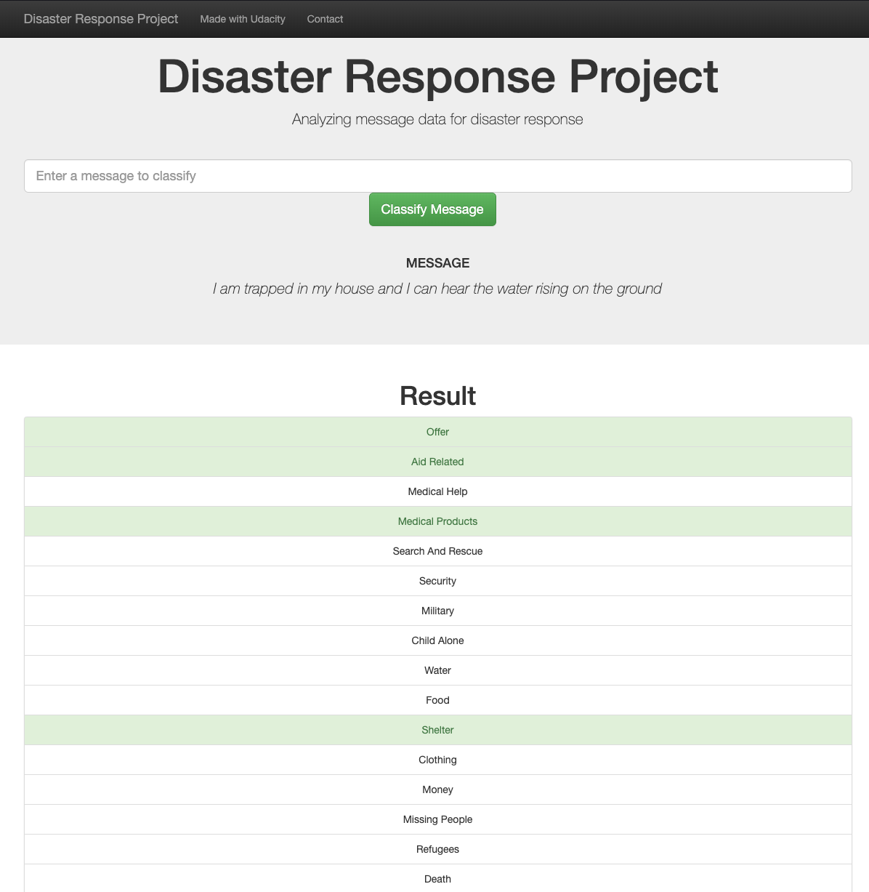

<h1><center>Disaster Response Unit Web-App</h1></center>
<h2><center>Tim Löhr</h2></center>
***Disaster Response Unit Pipeline Project for Udacity's Data Scientist Nanodegree Program***

### Motivation
In this project an ETL ("extract-transform-load") pipeline as well as a ML ("machine learning") pipeline is being build to train a model to categorize messages from the internet, if and how they are related to disasters like floods, riots etc. The trained model is then being used to be included in a web-app which allows entering a new message and obtaining the predictions regarding disaster related categories.  

The running app looks like the following:


## Content
```
- app
| - template
| |- master.html  # main page of web app
| |- go.html  # classification result page of web app
|- run.py  # Flask file that runs app

- data
|- disaster_categories.csv  # data to process
|- disaster_messages.csv  # data to process
|- process_data.py
|- InsertDatabaseName.db   # database to save clean data to

- models
|- train_classifier.py
|- classifier.pkl  # saved model

- README.md
```
## Getting Started

Clone the repository, to get our Notebooks, Presentation and Project Report.

```
git clone https://github.com/Mavengence/Disaster-Response-Unit-Figure_Eight.git
```

### Prerequisites

- You should use Python version 3
- You need git to get the source
- If you want to compile the report or the presentation by ur self u need a LaTex Compiler for your OS and maybe an IDE which makes things easier
- If you want to compile, train and play with our Code you need a python working environment. We used Jupyter Notebooks. The requiered packeges you can see in the Notebooks itself.

### Instructions for execution
1. Run the following commands in the project's root directory to set up the database and model.

    - To run the ETL pipeline that cleans data and stores the data in the database
        `python data/process_data.py data/disaster_messages.csv data/disaster_categories.csv data/DisasterResponse.db`
    - To run the Machine Learning and NLP pipeline that trains the classifier and saves it as pickle file
        `python models/train_classifier.py data/DisasterResponse.db models/classifier.pkl`

2. Run the following command to start the local host and the Flask Server.

    `python app/run.py`

3. Go to http://0.0.0.0:3001/

### Deployment

Just pull the repo and change anything you want

## Authors

* **Tim Löhr** - [GitHub Mavengence](https://github.com/Mavengence)

## License

Pretty much the BSD license, just don't repackage it and call it your own please!
Also if you do make some changes, feel free to make a pull request and help make things more awesome!

## Acknowledgments

Thanks Udacity Data Scientist Nanodegree program for providing the boiler template and the data and especially the knowledge for solving this project
